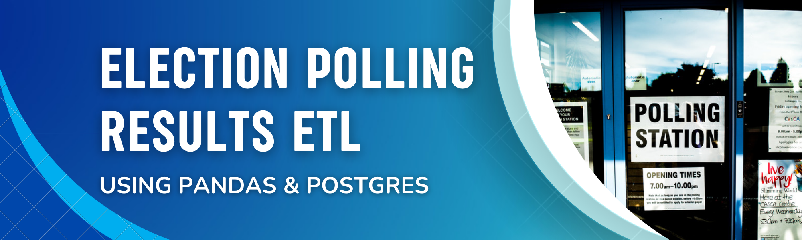

# etl-election-reporting  

Author:  Erin James Wills, ejw.data@gmail.com

<cite>Photo by <a href="https://unsplash.com/@eagleboobs?utm_source=unsplash&utm_medium=referral&utm_content=creditCopyText">Elliott Stallion</a> on <a href="https://unsplash.com/s/photos/election?utm_source=unsplash&utm_medium=referral&utm_content=creditCopyText">Unsplash</a></cite>

 

## Overview  

Used pandas to resolve discrepencies in real-time election poll results and moved data to postgres. 
