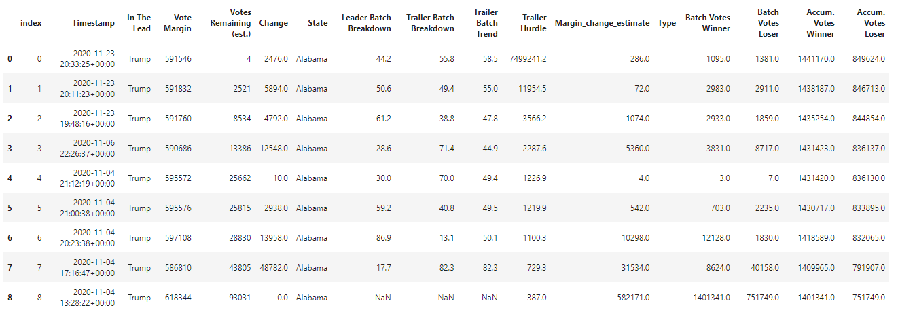

# etl-election-reporting  

Author:  Erin James Wills, ejw.data@gmail.com

<cite>Photo by <a href="https://unsplash.com/@eagleboobs?utm_source=unsplash&utm_medium=referral&utm_content=creditCopyText">Elliott Stallion</a> on <a href="https://unsplash.com/s/photos/election?utm_source=unsplash&utm_medium=referral&utm_content=creditCopyText">Unsplash</a></cite>

 

## Overview  

>Used pandas to resolve discrepencies in real-time election poll results and moved data to postgres.   

I have always found election poll results to be interesting since there are always unexpected results despite the number of polls performed prior to the election.  When looking at data that was published by the Associated Press, I noticed that the data released as results came in during election night was much messier than expected and often times had obviously incorrect data (or I initially presumed it to be false).  
The data was coming from Associated Press releases who got their information from the state election boards and was information distributed through the New York Times API.  There is already a nice Github repo that has the 2020 Presendential election results.  Some of the reason for the odd data is that:  
*  the information was not typed in correctly to the state updates that come from websites and twitter.  
*  the new update combines data from a previous update but people are unaware.
*  the new update corrects the numbers from the previous update and adds or subtracts votes.  Yes, there are times when the votes coming in to the API could be negative.  
*  there are probably more reasons but that is a separate analysis 
> Remember that none of this information is official on election night and usually several days go by before an official number is published.  

The goals are:
1.  create a jupyter notebook to identify records that do not make sense and see if merging these results with other rows will resolve the inconsistency.  Essentially, I am reducing the number of reported poll batches so the errors do not have an effect.  
2.  generate a dataset that is consistent so I can develop graphics and predictions based on the data as it is updated.
3.  store the data in a postgreSQL database and develop queries that could be used for generating a report. 

**Note:**  I mostly want realistic data for parts 2 and 3.  The first goal is to resolve most of the issues to have a believeable dataset.

 

## Technologies  
*  Python
*  PostgreSQL

   

## Data Source  

The dataset was obtained from:  
*  [https://alex.github.io/nyt-2020-election-scraper/all-state-changes.html](https://alex.github.io/nyt-2020-election-scraper/all-state-changes.html)  

**Note**:  The site data may be overwritten during each election.

 

## Analysis

### Notebook 

The data comes in a very complicated structure that needs to be broken down into separate columns.  Below is an example of what one state's data looks like initially:
 
  
After origanizing the data and using regular expressions to extract out the values from the text, the data forms two data frames.

Some of the data manipulations include:
*  Removing zeros from the 'Change' column
*  Removing values set as 'Unknown' from the 'Change' column
*  Calculating the 'Change' column for values that say 'Unknown' or zero when there is adequate information about the record
*  Remove records where the margin between batches is smaller than the batch size.

In the end, the following table was generated.  

The last part of the notebook sets up a final dataframe that is in a good format for a relational database.  The format is just a simple table with 4 columns - time of batch records, Trump votes, Biden votes, and state.  In the future I would love to add the district and maybe assign some metadata to that district so I can have more specific data extraction.  Right now I do not have the distric or type information which is a bit disappointing since macro scale data is not as interesting when doing an analysis.  All other summarizies can be derived from this simple data structure.  

### SQL

With SQL, the following are examples of queries written to extract data from the two tables.  

One table was generated from a query since this data would be considered very common.  This table ('margin_info') has the following columns:  'batch_id', 'datetime', 'state', 'biden_votes', 'trump_votes', 'batch_margin'.  The main difference in this table compared to the original table is that the data has been pivoted such that instead of having a row of biden data and a row of trump data for the same time period, those values have been put into their own column and the margin difference has also been calculated.  

**Note**:  This table creation may seem trivial but I created this structure since I believe it is a very common process.  It makes sense to collect data in a table for records in rows so that each time a new row comes in then it can be logged.  Then periodically the individual records will go through a processing event where records are summarized in a table where sorting or aggregation or a combination of the two will be needed to get a more readable and useable data structure.   

 

## Python Setup and Installation  
1. Environment needs the following:  
    *  Python 3.6+  
    *  numpy
    *  pandas
1. Activate your environment
1. Clone the repo to your local machine
1. Start Jupyter Notebook within the environment from the repo
1. To run `election_data_extract.ipynb`  
1. The above notebook produces a cleaned dataframe called `db_file.csv` inside the `data` folder.
## PostgreSQL Setup and Installation
1. Open pgAdmin and create a database named `uselections`
1. The .sql files can be found in the `sql` folder
1. Open a query tool and run the `create_vote_counts_table.sql` query to create the main table named `vote_counts`.
1.  Import the `db_file.csv` file into the `vote_counts` table.

## PostgreSQL Generate Other Tables
1. In another query tool, run `create_margin_info_table.sql` to generate the `margin_info` table which manipulates and summarizes the `vote_counts` table.
1. Running the `create_margins_views.sql` is optional.  This query creates a view that is equivalent to the `margin_info` table.
## PostgreSQL Queries
1. Examples of queries can be found in `vote_count_queries.sql` which has queries about the `vote_counts` table and the `margin_info_queries.sql` which has queries about the `margin_info` table.  

**Note**:  The `margin_info` queries can be modified to use the `margins` view instead.  
 

 
